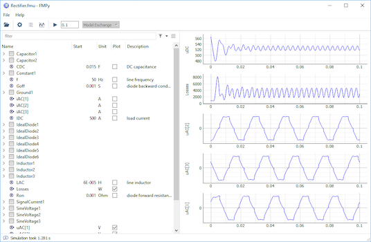
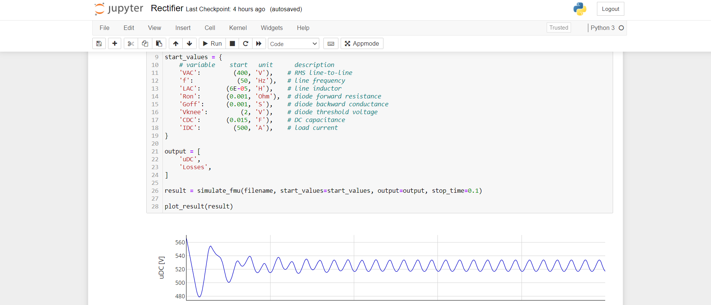
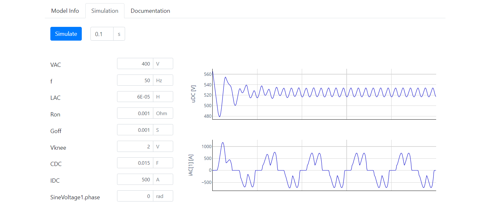

[](https://dev.azure.com/CATIA-Systems/FMPy/_build/latest?definitionId=1&branchName=develop)
[](https://pypi.org/project/FMPy/)
[](https://anaconda.org/conda-forge/fmpy)
[](https://fmpy.readthedocs.io/)

# FMPy

FMPy is a free Python library to simulate [Functional Mock-up Units (FMUs)](http://fmi-standard.org/) that...

- supports FMI 1.0, 2.0, and 3.0 beta (experimental)
- supports Co-Simulation and Model Exchange
- runs on Windows, Linux and macOS
- has a [command line](#simulate-an-fmu-on-the-command-line), [graphical user interface](#start-the-graphical-user-interface), and [web app](#start-the-web-app)
- creates [Jupyter Notebooks](#create-a-jupyter-notebook)
- compiles C code FMUs and generates [CMake](https://cmake.org/) projects for debugging

## Installation

Several options are available:

- Install with conda: `conda install -c conda-forge fmpy`
- Install with from PyPI: `python -m pip install fmpy[complete]`
- [Install a development build](docs/faq.md)

If you don't have Python on your machine you can install [Anaconda Python](https://www.anaconda.com/download/).

## Start the Graphical User Interface

You can start the FMPy GUI with `python -m fmpy.gui`



## Simulate an FMU in Python

To follow this example download `Rectifier.fmu` for your platform by clicking on the respective link:
[Linux](https://github.com/modelica/fmi-cross-check/raw/master/fmus/2.0/cs/linux64/MapleSim/2018/Rectifier/Rectifier.fmu),
[macOS](https://github.com/modelica/fmi-cross-check/raw/master/fmus/2.0/cs/darwin64/MapleSim/2018/Rectifier/Rectifier.fmu),
[Windows](https://github.com/modelica/fmi-cross-check/raw/master/fmus/2.0/cs/win64/MapleSim/2018/Rectifier/Rectifier.fmu).
Change to the folder where you've saved the FMU and open a Python prompt.

```
>>> from fmpy import *
>>> fmu = 'Rectifier.fmu'
>>> dump(fmu)  # get information

Model Info

  FMI Version       2.0
  Model Name        Rectifier
  Description       Model Rectifier
  Platforms         win64
  Continuous States 4
  Event Indicators  6
  Variables         63
  Generation Tool   MapleSim (1267140/1267140/1267140)
  Generation Date   2017-10-04T12:07:10Z

Default Experiment

  Stop Time         0.1
  Step Size         1e-07

Variables (input, output)

Name                Causality          Start Value  Unit     Description
outputs             output        282.842712474619  V        Rectifier1.Capacitor1.v
>>> result = simulate_fmu(fmu)         # simulate the FMU
>>> from fmpy.util import plot_result  # import the plot function
>>> plot_result(result)                # plot two variables
```


## Simulate an FMU on the command line

To get information about an FMU directly from the command line change to the folder where you've saved the
FMU and enter

```
fmpy info Rectifier.fmu
```

Simulate the FMU and plot the results

```
fmpy simulate Rectifier.fmu --show-plot
```

Get more information about the available options

```
fmpy --help
```

## Create a Jupyter Notebook

To create a [Jupyter](https://jupyter.org/) Notebook open an FMU in the FMPy GUI and select `Tools > Create Jupyter Notebook...` or run

```
fmpy create-jupyter-notebook Rectifier.fmu
```

on the command line and open the notebook in Jupyter with

```
jupyter notebook Rectifier.ipynb
```



## Start the Web App

The FMPy Web App is built with [Dash](https://plotly.com/dash/) and a great way to share your FMUs with anyone that has a web browser.
To start it run

```
python -m fmpy.webapp Rectifier.fmu
```

on the command line or use `--help` for more options.



## Advanced Usage

To learn more about how to use FMPy in you own scripts take a look at the
[coupled_clutches.py](fmpy/examples/coupled_clutches.py),
[custom_input.py](fmpy/examples/custom_input.py) and
[parameter_variation.py](fmpy/examples/parameter_variation.py) examples.

## Commercial Support

You're starting a project, need training or professional support?
Our partners at LTX Simulation are ready to help you.
Please send an e-mail to support@ltx.de for a quote.

------------------------------------

&copy; 2020 Dassault Syst&egrave;mes
