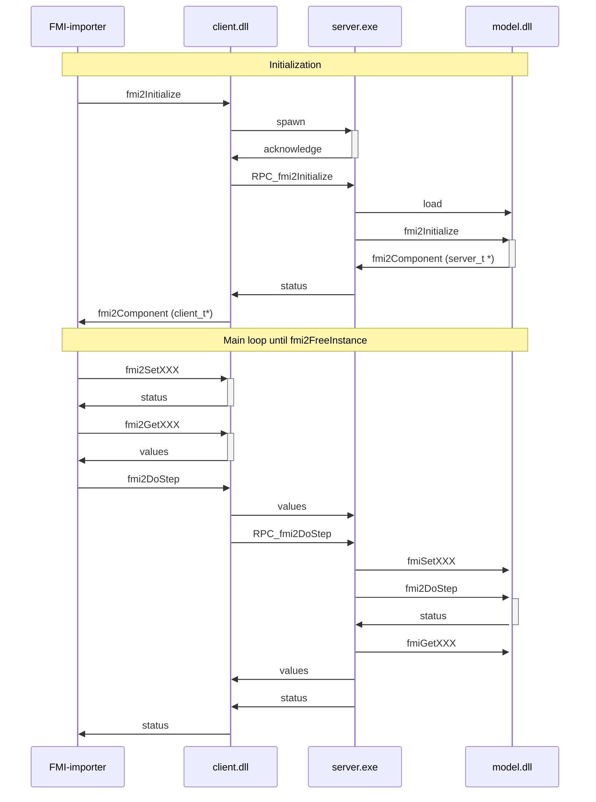

# FMU-Remoting

## Rationale

Some OS can support 32-bits and 64-bits. Remoting feature adds a new interface to a existing FMU and let
the user mix bitness between fmi-importer and the DLL contained into the FMU.

## Implementation

Current implementation relies on Shared Memory and Semaphore. It is available on Windows and Linux only.
Primary OS is Windows.

This version supports:
   - ONLY FMI 2.0, ONLY for co-simulation mode
   - Strings are NOT supported

### Sequence Diagram



### Performances

To improve performance, this implementation minimize the number of Inter Process Communication calls. So that,
values of signal of the DLL are cached on client side in local buffers.


### How it's work ?

Considering win64 FMU, only the `binaries/win64` folder is populated. It contains `model.dll`.

#### Add remoting win32: simulate 64bits FMU 32 bits OS
  1. Copy `client_sm.dll` (32 bits) as `model.dll` in `binaries/win32`
  2. Copy `server_sm.exe` (64 bits) in `binaries/win64`
  
When Simulation Enviroment will use the FMU on 32 bits OS:
  1. it will load  `win32/model.dll` (which is a copy of `client_sm.dll`)
  2. which will communicate with `win64/server_exe`.
  3. which will load `win64/model.dll` 

#### Add remoting win64: simulate 32 bits FMU 64 bits OS
  1. Copy `client_sm.dll` (64 bits) as `model.dll` in `binaries/win64`
  2. Copy `server_sm.exe` (32 bits) in `binaries/win32`
  
  When Simulation Enviroment will use the FMU on 64bits kernel:
  1. it will load  `win64/model.dll` (which is a copy of `client_sm.dll`)
  2. which will communicate with `win32/server_exe`.
  3. which will load `win32/model.dll` 


## Usage with `fmutool`

This feature is available easily with `fmutool` command line or with its graphical user interface:
```fmutool -input model64.fmu -add-remoting32 -output model64+32.fmu```


## LICENSE

The remoting code is part of [fmu-manipulation-toolbox](https://github.com/grouperenault/fmu_manipulation_toolbox)
It is released under the 2-Clause BSD license:

Copyright 2023-2026 Renault SAS

Redistribution and use in source and binary forms, with or without modification, are permitted
provided that the following conditions are met:

1. Redistributions of source code must retain the above copyright notice, this list of conditions
   and the following disclaimer.

2. Redistributions in binary form must reproduce the above copyright notice, this list of conditions
   and the following disclaimer in the documentation and/or other materials provided with 
   the distribution.

THIS SOFTWARE IS PROVIDED BY THE COPYRIGHT HOLDERS AND CONTRIBUTORS �AS IS� AND ANY EXPRESS OR
IMPLIED WARRANTIES, INCLUDING, BUT NOT LIMITED TO, THE IMPLIED WARRANTIES OF MERCHANTABILITY AND
FITNESS FOR A PARTICULAR PURPOSE ARE DISCLAIMED. IN NO EVENT SHALL THE COPYRIGHT HOLDER OR 
CONTRIBUTORS BE LIABLE FOR ANY DIRECT, INDIRECT, INCIDENTAL, SPECIAL, EXEMPLARY, OR 
CONSEQUENTIAL DAMAGES (INCLUDING, BUT NOT LIMITED TO, PROCUREMENT OF SUBSTITUTE GOODS OR SERVICES;
LOSS OF USE, DATA, OR PROFITS; OR BUSINESS INTERRUPTION) HOWEVER CAUSED AND ON ANY THEORY 
OF LIABILITY, WHETHER IN CONTRACT, STRICT LIABILITY, OR TORT (INCLUDING NEGLIGENCE OR OTHERWISE)
ARISING IN ANY WAY OUT OF THE USE OF THIS SOFTWARE, EVEN IF ADVISED OF THE POSSIBILITY OF SUCH
DAMAGE.
