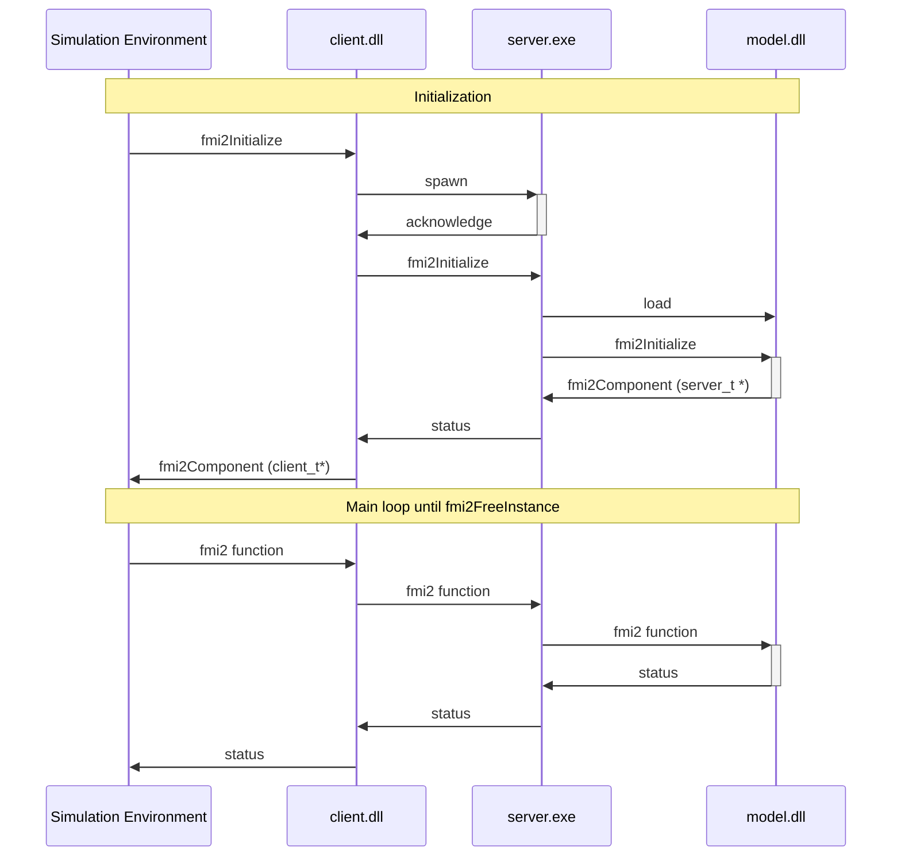

 # Remoting FMU
 
## Purpose

Run DLL model into a separate process.

## Implementation

Current implementation relies on Shared Memory and is available on Windows only.



### How it's work ?

Considering win64 FMU, only the `binaries/win64` folder is populated. It contains `model.dll`.

#### Using ```-add-remoting-win32``` will
  1. Copy `client_sm.dll` as `model.dll` in `binaries/win32`
  2. Copy `server_sm.exe` in `binaries/win32`
  
When Simulation Enviroment will use the FMU on 32bits kernel:
  1. it will load  `win32/model.dll` (which is a copy of `client_sm.dll`)
  2. which will communicate with `win64/server_exe`.
  3. which will load `win64/model.dll` 

#### Using ```-add-remoting-win64```
  1. Rename `win64/model.dll` into `win64/real-model.dll`
  2. Copy `client_sm.dll` as `model.dll` in `binaries/win64`
  3. Copy `server_sm.exe` in `binaries/win64`
  
  When Simulation Enviroment will use the FMU on 64bits kernel:
  1. it will load  `win64/model.dll` (which is a copy of `client_sm.dll`)
  2. which will communicate with `win64/server_exe`.
  3. which will load `win64/real-model.dll` 

## TODO List

- [X] Unique name for event/memory
- [X] Deep tests for Stings getters/setters
- [X] Perfomances tests (and improvement if needed)
- [ ] Support for more fmi2 function
- [ ] Support for fmi3
- [ ] TCP/IP communication ?
  - [ ] Linux support ?
  