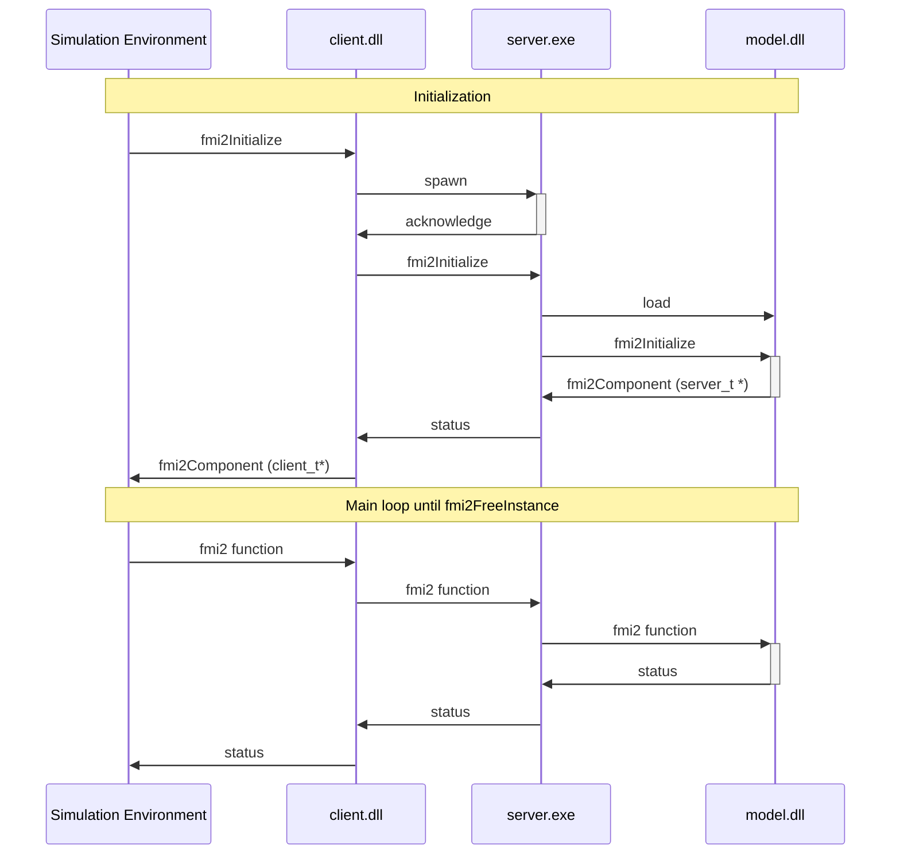

```
    ___                                               __   __              
  .'  _|.--------.--.--.  .----.-----.--------.-----.|  |_|__|.-----.-----.
  |   _||        |  |  |  |   _|  -__|        |  _  ||   _|  ||     |  _  |
  |__|  |__|__|__|_____|  |__| |_____|__|__|__|_____||____|__||__|__|___  |
                                                                    |_____|
```

## Purpose

Run model contained inside FMU (which is a shared library) into a separate process.
The calling process may be in different bitness than the model (shared library).

## Implementation

Current implementation relies on Shared Memory and is available on Windows, Linux and MacOS only.



### How it's work ?

Considering win64 FMU, only the `binaries/win64` folder is populated. It contains `model.dll`.

#### Add remoting win32: simulate 64bits FMU 32 bits OS
  1. Copy `client_sm.dll` (32 bits) as `model.dll` in `binaries/win32`
  2. Copy `server_sm.exe` (64 bits) in `binaries/win64`
  
When Simulation Enviroment will use the FMU on 32 bits OS:
  1. it will load  `win32/model.dll` (which is a copy of `client_sm.dll`)
  2. which will communicate with `win64/server_exe`.
  3. which will load `win64/model.dll` 

#### Add remoting win64: simulate 32 bits FMU 64 bits OS
  1. Copy `client_sm.dll` (64 bits) as `model.dll` in `binaries/win64`
  3. Copy `server_sm.exe` (32 bits) in `binaries/win32`
  
  When Simulation Enviroment will use the FMU on 64bits kernel:
  1. it will load  `win64/model.dll` (which is a copy of `client_sm.dll`)
  2. which will communicate with `win32/server_exe`.
  3. which will load `win32/model.dll` 


## TODO List

- [X] Unique name for event/memory
- [X] Deep tests for Stings getters/setters
- [X] Perfomances tests (and improvement if needed)
- [X] Support for more fmi2 function
- [ ] Support for fmi3
- [ ] network communication (multi-OS communication)


## LICENSE

The remoting code is written by Nicolas.LAURENT@Renault.com. It is based on FMPy original ideas.
This code is released under the 2-Clause BSD license:

Copyright 2023 Renault SAS

Redistribution and use in source and binary forms, with or without modification, are permitted
provided that the following conditions are met:

1. Redistributions of source code must retain the above copyright notice, this list of conditions
   and the following disclaimer.

2. Redistributions in binary form must reproduce the above copyright notice, this list of conditions
   and the following disclaimer in the documentation and/or other materials provided with 
   the distribution.

THIS SOFTWARE IS PROVIDED BY THE COPYRIGHT HOLDERS AND CONTRIBUTORS "AS IS" AND ANY EXPRESS OR
IMPLIED WARRANTIES, INCLUDING, BUT NOT LIMITED TO, THE IMPLIED WARRANTIES OF MERCHANTABILITY AND
FITNESS FOR A PARTICULAR PURPOSE ARE DISCLAIMED. IN NO EVENT SHALL THE COPYRIGHT HOLDER OR 
CONTRIBUTORS BE LIABLE FOR ANY DIRECT, INDIRECT, INCIDENTAL, SPECIAL, EXEMPLARY, OR 
CONSEQUENTIAL DAMAGES (INCLUDING, BUT NOT LIMITED TO, PROCUREMENT OF SUBSTITUTE GOODS OR SERVICES;
LOSS OF USE, DATA, OR PROFITS; OR BUSINESS INTERRUPTION) HOWEVER CAUSED AND ON ANY THEORY 
OF LIABILITY, WHETHER IN CONTRACT, STRICT LIABILITY, OR TORT (INCLUDING NEGLIGENCE OR OTHERWISE)
ARISING IN ANY WAY OUT OF THE USE OF THIS SOFTWARE, EVEN IF ADVISED OF THE POSSIBILITY OF SUCH
DAMAGE.
